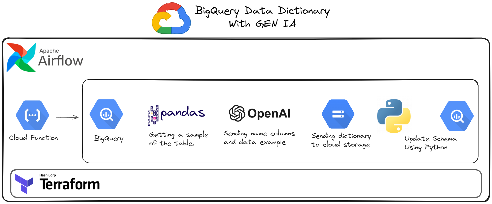

## *Architecture*

<div aling="center">
  
</div>


### Prerequisites
1. Clone the repo
   ```
   git clone https://github.com/phillipefs/dictionary-bigquery-tables-with-gen-ai.git
   ```
2. Create folder configs and create .env file
   ```
    openai_key     = "xxxxxxxxxxx"
    api_version    = "xxxxxxxxxxx"
    azure_endpoint = "xxxxxxxxxxx"
    model_engine   = "xxxxxxxxxxx"
    gcp_project_id = "xxxxxxxxxxx"
   ```
3. Export Json Key Service Account GCP
   ```
   configs/service_account_key.json
   ```
4. Install requirements file
   ```
   pip install -r requirements.txt
   ```
5. Run app
   ```
   python .\app.py
   ```
